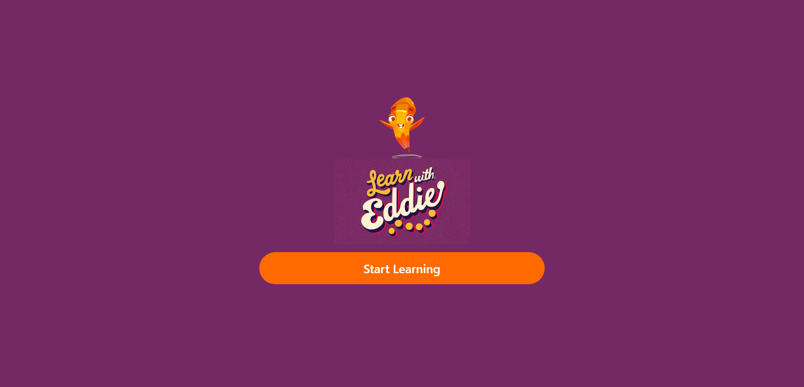

<h1 align="center">
Quiz Application
</h1>


<div align="center">

<h2>

[🚀Live Site](<!-- link to the site -->)

</h2>
</div>

<!-- Badges -->
<div align="center">
    

<!-- License -->


</div>

<p align="center">
This is a web application that showcases a quiz web application. Users can be able to answer questions according to a topic of their choice and eventually be shown the results of their answers. The project is built as a Single Page Application hence it is all in one place.
</p>

<!-- Screenshots -->
<a align="center">



</a>

## Technologies Used

- Vanilla JavaScript for application logic and event handling.
- Tailwind for styling of the markup.
- HTML for markup.

## Project Structure

The project is built as a Single Page Application (all in the index.html page) where each div in the index is a page for the application hence each page of the application has a JavaScript file associated with it.

### How the <code>index.html</code> page is structured.
1. **Index (index.html):**
    - The page that holds the whole Single Page Application.
    - All pages of the application are found in the index.

```html
    .
    .
    .
    <body>

        <!-- Pages -->

        <!-- Starting page -->
        <div class="page active" id="start"></div>

        <!-- Settings Page -->
        <div class="page" id="customSettings"></div>

        <!-- results Page -->
        <div class="page active" id="results"></div>

        <!-- Other pages to follow -->
    </body>
    .
    .
    .

```

### How it works?
All the <code>div</code> elements in the <code>index.html</code> page have the <code>.page</code> class which makes the page take the full width and height of the whole page but also hidden by default. Only the page that is being displayed currently should be visible and that's why we have teh active class on the first <code>div</code> element.

When a navigation is made on the page then the <code>.active</code> class is removed from the current page and put on the next current page (where the user is going)

I also created a custom event that will fire once a page is displayed to do some of the stuff that is needed for the quiz application like <code>animations</code> etc.

Here is the master of the magic  behind the scenes:

**main.js:**
```javascript
import * as questions from './questions.js';
import * as results from './results.js';
import * as customize from './customSettings.js';
import * as userAnswers from './userAnswers.js';

    const app = {
        /* all the pages in index */
        pages:[],
        /* custom Event */
        show:new Event('show'),

        /* initialize once the page is loaded */
        init:function(event){
        },

        /* Handles the navigation of the pages */
        nav:function(event){
        },

        /* Handles the functions that are called when specific pages are shown. */
        pageShown:function(event){
        },

        /* Handles the backward navigation of the pages like the pop-state events (that is the user clicks the back or forward button in the browser history) */
        poppin:function(event){
        }
    };
```
## Key Features

Users are able to:

- Choose a topic of which the user wants to asked the questions for example Science, History etc.
- Choose the number of questions that the user wants to be asked where the minimum is 5 and the maximum is 15.
- View all the questions that the user failed and passed to see where they can improve.


## What I Learned:
When it comes to the creating SPA's i learn how to mimic the functionality of a Single Page Application with Vanilla JavaScript which is very beneficial hence will help me when I'm building the same projects with <code>React</code>. It gives me a glace on how Single Page Applications work.

Overall, it was a great learning experience, and I'm excited to use these skills in future projects to create even better and more user-friendly web applications.


## Author

<b>👱🏿‍♂️ devjhex</b>

- Twitter - [@devJhex](https://www.twitter.com/devJhex)
- Frontend Mentor - [@devjhex](https://www.frontendmentor.io/profile/devjhex)
- Github: [@devjhex](https://github.com/devjhex)

Feel free to contact me with any questions or feedback!